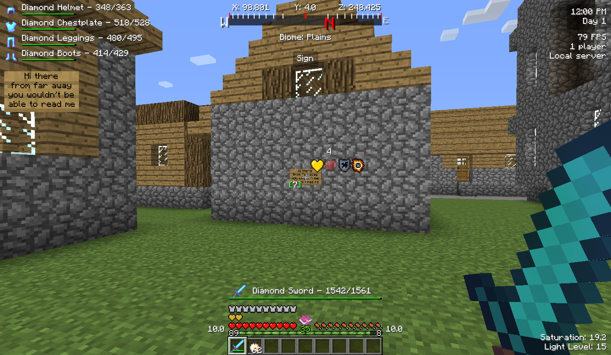

# [Better HUD](https://minecraft.curseforge.com/projects/better-hud)

[](https://github.com/mccreery/better-hud/releases)
[](https://www.curseforge.com/minecraft/mc-mods/better-hud)

Better HUD is a Forge mod which adds many different configurable elements to your in-game HUD. Everything can be enabled or disabled and customised to your liking, giving you lots of control over the information you see.



## 1.20.1 Development Environment

- Your IDE project should use a Java 17 SDK.

- In IntelliJ, the `runClient` and `runServer` Gradle tasks have more descriptive names than those generated by `genIntellijRuns` and can be pinned directly as run configurations.

- [DevAuth](https://github.com/DJtheRedstoner/DevAuth) is enabled by default. This mod authenticates your Minecraft account via OAuth so you can join servers in your development environment. If you don't feel comfortable with this, disable DevAuth by removing this line from [build.gradle](/build.gradle):

  ```groovy
  jvmArgs '-Ddevauth.enabled=true', '-Ddevauth.account=main'
  ```
